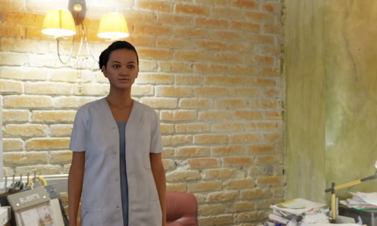
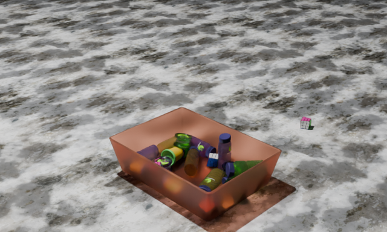
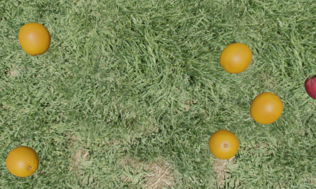
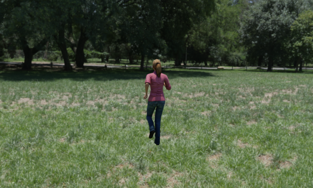
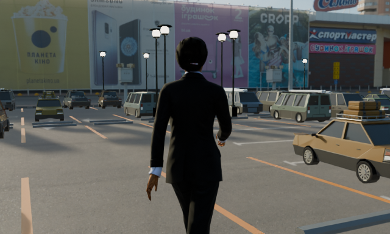

# Toybox

**Open-source synthetic-data channel** for Rendered.ai. Generates annotated images and video of humans and objects in real environments — rendered by Blender Cycles, seeded per run, permissively licensed for ML training.

Toybox ships five hero graphs covering the common workflow patterns you can build on: rigid-body physics scenes, HDRI-backed outdoor / indoor scenes, avatar diversity via a demographic-filtered pool, per-frame annotated video, and artist-authored `.blend` environments loaded wholesale.

## What you get from every run

Standard directory layout, ready for most training pipelines:

- **`images/`** — the RGB render, one file per frame.
- **`masks/`** — instance segmentation (one colour per object of interest). Depth and surface-normal passes are one toggle on the Render node.
- **`annotations/`** — per-frame JSON with bounding boxes, class labels, and per-object occlusion values.
- **`metadata/`** — per-run metadata, seed, and every wired parameter for reproducibility.
- **`preview.png`** — a low-res thumbnail written on `--preview` runs.

Same seed + same graph = same output. Datasets reproduce.

## Showcase graphs

### `default` — rigid-body physics

Toys drop into a random container and gravity resolves them into a pile. Container and floor materials vary per run; overhead light XY and radiant power sweep; Outdoor Camera picks a fresh named angle each run (Overhead / Side / Corner / Entrance).

Uses: `Toy` · `Container` · `Floor` · `Place Over Container` · `Color Variation` · `Warp` · `Weight` · `Light` · `Outdoor Camera` · `Procedural Scene` · `Render`.

### `fruit_hdri_test` — HDRI outdoor scene

Apples and oranges scattered on a Poly Haven grass HDRI with no Floor node — the HDRI's own ground reads through. Sun angle randomizes per run.

Uses: `Fruit` · `Random Placement` · `Procedural Scene` (HDRI + rotation) · `Parameterized Camera` · `Render`.

### `avatar_animation_demo` — video-frame pipeline

Rocketbox `Bip01` rig converted to `rendered_humanoid`, animated with a run cycle whose baked root motion drives the character forward. `Animation Render` writes 24 per-frame masks and annotations per run. `Random Choice` constrains heading to East / West with jitter so the runner stays laterally near origin.

Uses: `Avatar Convert` · `Avatar Animation` · `Random Choice` · `Manual Placement` · `Parameterized Camera` · `Procedural Scene` · `Animation Render`.

### `avatar_hdri_indoor_test` — avatar diversity + HDRI backdrop

Different female avatar per run, sampled from a demographic-filtered pool via `Avatar Randomizer`. Pose file, pose frame, HDRI backdrop, HDRI rotation, XY position, and heading all vary independently — five axes of per-run variation that compose combinatorially. Camera Look At Z reads from the randomizer's Height output so framing tracks whichever avatar came up.

Uses: `Avatar Randomizer` · `Avatar Convert` · `Avatar Pose` · `Manual Placement` · `Parameterized Camera` · `Procedural Scene` · `Render`.

### `parking_lot_blend_scene` — artist-authored environment

BYO artist-authored `.blend`: `ParkingLot.blend` supplies asphalt geometry, parked cars, curbside props, and baked world. A Rocketbox avatar walks through it. Camera XY jitters around a fixed look-at so different subsets of the parked-car cluster appear behind the avatar across runs.

Uses: `Blend File Scene` · `Avatar Convert` · `Avatar Pose` · `Manual Placement` · `Parameterized Camera` · `Render`.

## Node library at a glance

Every node's inline help is one click away — the `i` icon on any node opens its help page.

### Objects

| Node | Purpose |
|---|---|
| `Toy`, `Fruit`, `Container`, `Floor` | Instance a specific asset or `<random>` from a family. |
| `Character`, `Avatar Convert` | Load a `rendered_humanoid` `.blend` directly (`Character`), or normalise an arbitrary `.fbx` / `.blend` upload (`Avatar Convert`). |
| `Avatar Randomizer` | Pick one asset-standard avatar per run from a demographic-filtered pool. |
| `Avatar Pose`, `Avatar Animation` | Freeze a static pose (still frame) or attach a motion clip (video). |

### Modifiers

| Node | Purpose |
|---|---|
| `Color Variation` | Recolour each spawned object. |
| `Scale`, `Warp` | Per-axis resize or per-object shape distortion. |

### Placement

| Node | Purpose |
|---|---|
| `Random Placement` | Flat scatter — every object visible, non-overlapping. |
| `Place Over Container` | Tight Z column above a container so gravity stacks the pile. |
| `Spatial Cluster` | Deterministic pattern (Random / Circular / Hexagonal). |
| `Manual Placement` | Exact position and rotation for one object. |

### Scenes

| Node | Purpose |
|---|---|
| `Procedural Scene` | Assemble a scene from parts (placement + floor + container + lights + HDRI + camera). |
| `Blend File Scene` | Load a `.blend` as the whole environment; overlay placed objects on top. |

### Lighting

| Node | Purpose |
|---|---|
| `Light` | Spot / point light for interior scenes. |
| `Sun` | Directional sunlight parameterised by elevation, azimuth, warmth. |

### Cameras

| Node | Purpose |
|---|---|
| `Procedural Camera` | Auto-aimed, tabletop-friendly (random position at fixed altitude, always looks down). |
| `Outdoor Camera` | Named viewpoints (Overhead / Side / Corner / Entrance) at a set distance. |
| `Parameterized Camera` | Exact XYZ position + look-at + focal length. |

### Randomization

| Node | Purpose |
|---|---|
| `Random Uniform`, `Random Integer`, `Random Normal` | Per-run numeric samples. |
| `Random Choice` | Pick one element from a list. |
| `Weight` | Bias generator selection probability. |
| `Vector3D`, `Addition`, `Multiply` | Compose sampled values into vectors or derived numbers. |

### Terminal

| Node | Purpose |
|---|---|
| `Render` | Single-frame render + masks + annotations. |
| `Animation Render` | Multi-frame render for video datasets. |

## Open source, permissively licensed

- **Channel code** — Apache-2.0.
- **Assets** — every asset the showcase graphs reference is CC0 (Rendered.ai props, Poly Haven HDRIs) or MIT (Microsoft Rocketbox avatars and animations).
- **ML training** — explicitly permitted. Toybox deliberately does not depend on assets whose licenses ambiguously address ML-training use.

## Learn more

- **Repository**: source, contribution guide, and the full showcase-graph reference — [Toybox on GitHub](https://github.com/rendered-ai/toybox).
- **Getting assets**: `docs/GETTING_ASSETS.md` in the repo — per-asset provenance and download instructions for reproducing the graphs from public sources.
- **Rocketbox avatars and animations**: <https://github.com/microsoft/Microsoft-Rocketbox> (MIT).
- **Poly Haven HDRIs**: <https://polyhaven.com/hdris> (CC0).
- **Rendered.ai platform**: <https://rendered.ai>.
